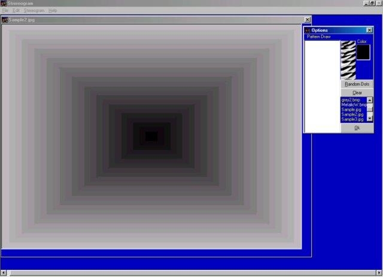

<div align="center">

## A 3D Stereogram Generator \(Beta Release 1\)


</div>

### Description

To make those 3D stereograms.

Some people know these by their commercial form of magic eye.

Just load a picture, a pattern, and click generate.

And like magic a picture with your hidden face inside.

Very Commented, and i believe is easy to understand.
 
### More Info
 
Image Files

It uses all 16.7 billion colors to determine depth, with white highest and black lowest. All of my samples are greyscale just because it is easier to gradient through the spectrum.

3D Image Files

If you do it too long you might get a headache!


<span>             |<span>
---                |---
**Submitted On**   |2001-06-26 22:22:00
**By**             |[Not Available \-\- Andy Something](https://github.com/Planet-Source-Code/PSCIndex/blob/master/ByAuthor/not-available-andy-something.md)
**Level**          |Advanced
**User Rating**    |4.9 (73 globes from 15 users)
**Compatibility**  |VB 5\.0, VB 6\.0
**Category**       |[Graphics](https://github.com/Planet-Source-Code/PSCIndex/blob/master/ByCategory/graphics__1-46.md)
**World**          |[Visual Basic](https://github.com/Planet-Source-Code/PSCIndex/blob/master/ByWorld/visual-basic.md)
**Archive File**   |[A 3D Stere217556262001\.zip](https://github.com/Planet-Source-Code/not-available-andy-something-a-3d-stereogram-generator-beta-release-1__1-24475/archive/master.zip)

### API Declarations

```
Vote if you like, and leave comments.
I like comments!!! Do you¿
```


